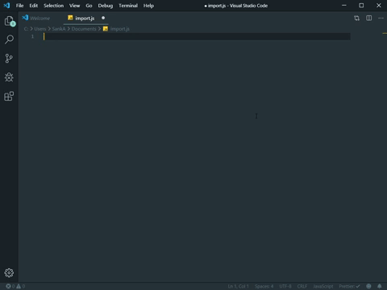
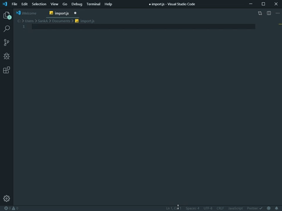

# vs code React Native Snippets

> tutorial 1
> 

> tutorial 2
> 

This extension can Javascript and ReactNative/Redux snippets in ES6, ES7 plugin features in vs code

## How used

#Make a folder "reactnativeSnippetslk" in Everywhere On Your PC.

#Then after "vs-code-react-native-snippets-extension" inside folder and files Copy to "reactnativeSnippetslk" folder.

#Then Copy to

> C:\Users\{Username}\.vscode\extensions

#Now Start Your Vs Code

## Features

> You can Use for React and React Native Languages. easy Way to find a Snippets & quikly make Your repositories.

## Supported Languages

    - [x] JavaScript (.js)
    - [x] JavaScript React (.jsx)
    - [x] ReactJS (.js)
    - [x] React Native (.js)
    - [x] React Native StyleSheet (.js)

## Basic Methods

    | Command | Description |
    | --- | --- |
    | imc | import React, {Component} from 'react'; |
    | im | import {  } from 'react-native'; |
    | * | import * as React from 'react'; |
    | imr | import React from 'react'; |
    | consty | const styles = StyleSheet.create({", "    }); |
    | vs | <View style={styles.main}>$1</View> |
    | vt | <Text style={styles.title}>$1</Text> |
    | vi | <TextInput", "style={styles.itemInput}", " placeholder=", "  /> |
    | vh | <TouchableHighlight", "style={$1}", "   </TouchableHighlight> |
    | sv | <SafeAreaView style={$1}>", "</SafeAreaView> |
    | sc | <ScrollView style={styles.scrollView}>", "</ScrollView> |
    | ai | <ActivityIndicator size= /> |
    | dap | <DatePickerIOS date={this.state.chosenDate} onDateChange={this.setDate}/> |
    | imgs | <Image style={styles.stretch} source={require('..')}/> |
    | imb | <ImageBackground source={...} style={{width: '100%', height: '100%'}}></ImageBackground> |
    | kav | <KeyboardAvoidingView style={styles.container}></KeyboardAvoidingView> |
    | pba | <ProgressBarAndroid styleAttr=/> |
    | clg | console.log(obj) |
    | cw | console.warn |
    | ren | render() { return( ) }; |
    | set |  this.setState({ }) |
    | jus | justifyContent: '', |
    | alit | alignItems: '${1}', |
    | asr | aspectRatio: '', |
    |borw | borderWidth: , |
    | flex |flexDirection: '', |
    | h | height: , |
    | w | width: , |
    | l | left: '', |
    | ri | right: , |
    | mrh | marginHorizontal: '', |
    | pah | paddingHorizontal: , |
    | max | maxWidth: , |
    | min | minWidth: , |
    | op | opacity: , |
    | bgc | backgroundColor: , |
    | dir | direction: , |
    | pos |  position: , |
    | impa |  import React from 'react';
      import {  } from 'react-native';
      export default class AddItem extends Component {
       render(){
           return (
               <View>

               </View>
           );
       }
      } |
      | prop | import React, { Component } from 'react';

      export default class create extends Component {
      constructor(props) {
      super(props);

      this.state = {
       };
       }
      render() {
      return (
      );
      } |

## Known Issues

Every space inside { }; and ( ) means that this is pushed into next line :) \$ represent each step after tab.

### 1.0.0

Initial release of React Native SnappetsLK

### For more information

- [My GitHub Account](https://github.com/sankageethanjana?tab=repositories)
- [Contact me on Linkdin](https://www.linkedin.com/in/sanka-geethanjana-a19a8a16a/)

**Enjoy!**
